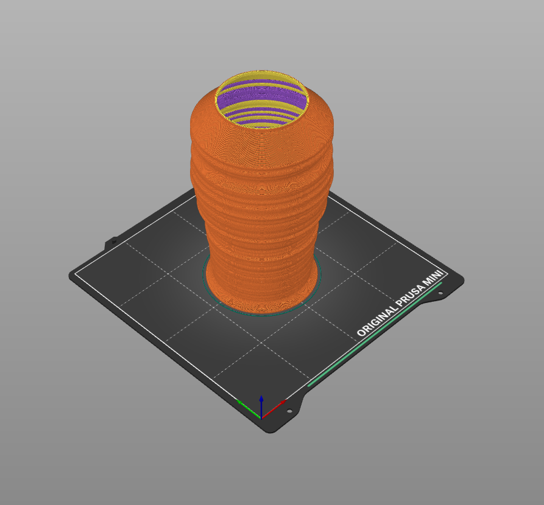

# mp3-to-stl

## About
This repo contains a Python script that converts an MP3 file into an STL model.
It analyses the waveform of the audio file and generates a 3D representation
that can then be customised and exported for printing.

## Usage
- Dependencies are already defined in `pyproject.toml`, so simply run `pip install .`
- Adjust the parameters directly in [`mp3-to-stl.py`](./mp3-to-stl.py#L4-L16).
- Run the Python script with `python mp3-to-stl.py`

## Printing
I'd recommend going for a single-shell and
[tweaking the settings in a slicer](https://www.printables.com/model/1435084-custom-vase-from-mp3-audio#-settings).
The code also has an option to add a wall if you're looking for an even sturdier result.

## Example

